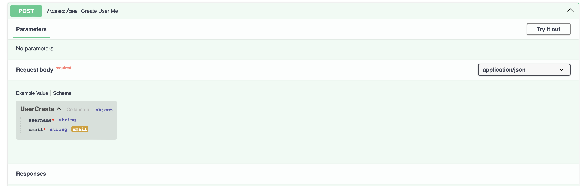

# Практическая работа 16

## Изучить  способы  и  протоколы  аутентификации.  Выбрать  один  из  протоколов для реализации механизма аутентификации по токенам

Были изучены способы и протоколы аутентификации. Выбран JWT стандарт в связи с Acess + Refresh токенами.

## Выбрать  язык  программирования  для  создания  сервера.  Определить необходимые  библиотеки  для  создания  сервера  ии реализации  механизма аутентификации.

Для создания сервера был выбран язык - Python а также библиотеки:

- `fastapi`: Современный веб-фреймворк для создания API на Python с высокой производительностью и автоматической генерацией документации.
- `uvicorn`: ASGI-сервер для Python, предназначенный для запуска асинхронных веб-приложений.
- `sqlalchemy[asyncio]`: Мощная ORM для работы с базами данных, позволяющая использовать асинхронное программирование.
- `asyncpg`: Асинхронный драйвер для PostgreSQL с высокой производительностью и удобным интерфейсом для запросов.
- `alembic`: Инструмент для управления миграциями баз данных в SQLAlchemy, позволяющий обновлять схему базы данных.
- `redis`: Высокопроизводительная база данных NoSQL в памяти, часто используемая для кэширования и управления сессиями.
- `celery`: Асинхронный фреймворк для выполнения задач в фоновом режиме, позволяющий организовывать распределенные системы обработки задач.
- `flower`: Веб-интерфейс для мониторинга и управления задачами Celery, предоставляющий информацию о текущих задачах и работниках.
- `python-dotenv`: Библиотека для загрузки переменных окружения из файла `.env`, удобная для управления конфиденциальной информацией.
- `pydantic`: Библиотека для валидации данных и работы с моделями на основе аннотаций типов.
- `pydantic-settings`: Расширение для Pydantic, позволяющее управлять настройками приложения из различных источников.
- `email-validator`: Библиотека для валидации адресов электронной почты, проверяющая их формат и доступность.
- `aiosmtplib`: Асинхронный клиент для отправки электронной почты через SMTP, поддерживающий асинхронное программирование.
- `Jinja2`: Шаблонизатор для генерации текстовых файлов с помощью гибкого синтаксиса.
- `pytest`: Популярный фреймворк для тестирования Python с простой структурой тестов и множеством плагинов.
- `httpx`: Асинхронная библиотека для работы с HTTP, поддерживающая синхронные и асинхронные запросы.
- `python-multipart`: Библиотека для обработки форматов `multipart/form-data`, используемых для загрузки файлов через формы.
- `python-jose[cryptography]`: Библиотека для работы с JSON Web Tokens (JWT) с поддержкой криптографии.
- `passlib[bcrypt]`: Библиотека для управления хэшированием паролей с поддержкой различных алгоритмов, включая bcrypt.
- `bcrypt`: Библиотека для хэширования паролей с использованием алгоритма bcrypt, обеспечивающая высокую степень безопасности.
- `colorlog`: Библиотека для форматирования логов с цветовым выводом в терминале, делающая логи более читаемыми.

## Подключить  базу  данных  для  хранения  данных  пользователя,  создать структуры базы данных (путем миграции, скрипта и т.п.)

Была подключена база данный PostgreSQL для храния пользователей и их данных, также была создана структура, используя alembic.

##  Реализовать  для  пользователя  регистрацию,  авторизацию  и  действие, требующее аутентификации.

Для пользователя были реализованы такие действия как регистрация, авторизация и действия требующие аутентификации

### Регистрация

### Авторизация

### Аутентификация

## С  помощью  средств  тестирования  (Postman,  SoapUI  и т.п.) продемонстрировать результат регистрации и авторизацию.

С помощью SwaggerUI были продемонстрированы результаты регицистраа и авторизации

### Регистрация

### Авторизация

> При подтверждении аккаунта происходит автоматическая авторизация

## Продемонстрировать  результаты  выполнения  аутентифицированного  и не аутентифицированного запросов.

Были продемонстрированны результаты выполненияя запроса с аутентификацией и без.

### С действительным токеном

### С просроченным токеном

##  Подготовить  материалы  в  отчет  о  выполнении  практического  курса занятий. 

Был подготовлен отчёт и материалы о выполнении практической работы.

