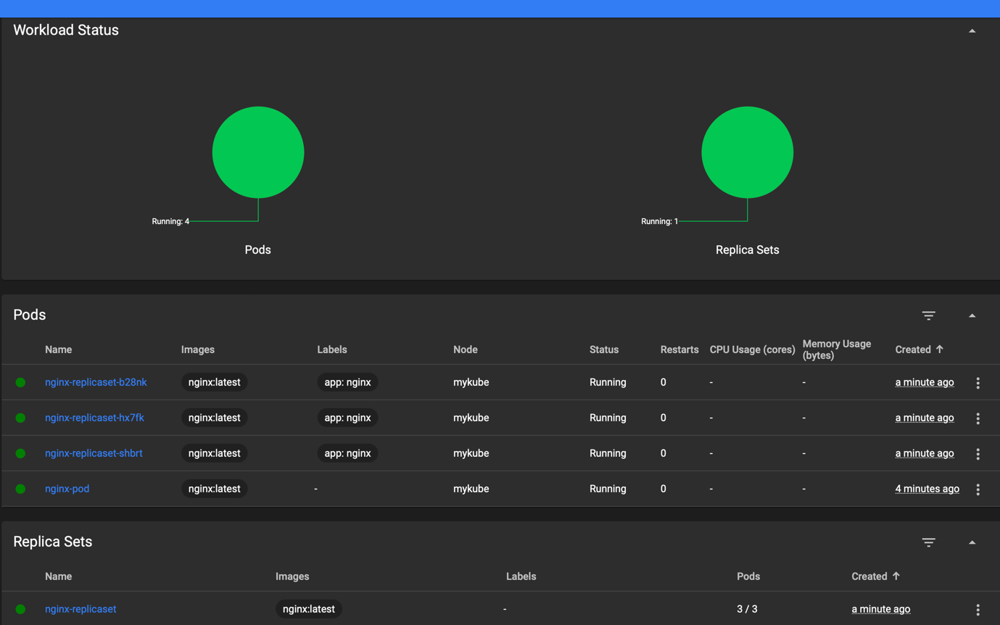

# Практическая работа №17*

## Определить материнскую (host) операционную систему (Windows, Linux, Mac OS). Установить Docker. Целесообразно использовать результаты практической работы No2.

Host - macos

## Развернуть мини-кластер посредством kind, k0s или minikube (потребуется гипервизор). Определить наименование кластера.

миникуб - 
```
/Users/iyunakov/MeGitHub/ISEnt [feature/prac17]
%  minikube start -p mykube 

😄  [mykube] minikube v1.34.0 на Darwin 14.6.1 (arm64)
✨  Automatically selected the docker driver
📌  Using Docker Desktop driver with root privileges
👍  Starting "mykube" primary control-plane node in "mykube" cluster
🚜  Pulling base image v0.0.45 ...
🔥  Creating docker container (CPUs=2, Memory=3873MB) ...
🐳  Подготавливается Kubernetes v1.31.0 на Docker 27.2.0 ...
    ▪ Generating certificates and keys ...
    ▪ Booting up control plane ...
    ▪ Configuring RBAC rules ...
🔗  Configuring bridge CNI (Container Networking Interface) ...
🔎  Компоненты Kubernetes проверяются ...
    ▪ Используется образ gcr.io/k8s-minikube/storage-provisioner:v5
🌟  Включенные дополнения: storage-provisioner, default-storageclass
🏄  Готово! kubectl настроен для использования кластера "mykube" и "default" пространства имён по умолчанию
/Users/iyunakov/MeGitHub/ISEnt [feature/prac17]
% minikube profile list             

|---------|-----------|---------|--------------|------|---------|---------|-------|----------------|--------------------|
| Profile | VM Driver | Runtime |      IP      | Port | Version | Status  | Nodes | Active Profile | Active Kubecontext |
|---------|-----------|---------|--------------|------|---------|---------|-------|----------------|--------------------|
| mykube  | docker    | docker  | 192.168.49.2 | 8443 | v1.31.0 | Running |     1 |                | *                  |
|---------|-----------|---------|--------------|------|---------|---------|-------|----------------|--------------------|
```


## Установить инструмент командной строки kubectl.

```
/Users/iyunakov/MeGitHub/ISEnt [feature/prac17]
% kubectl version --client

Client Version: v1.31.1
Kustomize Version: v5.4.2

```

## Убедиться, что кластер создан и в kubectl добавилась конфигурация (context) кластера, продемонстрировать существующие пространства имен (namespace) кластера.

```
/Users/iyunakov/MeGitHub/ISEnt [feature/prac17]
% kubectl config get-contexts

CURRENT   NAME             CLUSTER          AUTHINFO         NAMESPACE
          docker-desktop   docker-desktop   docker-desktop   
*         mykube           mykube           mykube           default
/Users/iyunakov/MeGitHub/ISEnt [feature/prac17]
% kubectl get namespaces

NAME              STATUS   AGE
default           Active   2m2s
kube-node-lease   Active   2m1s
kube-public       Active   2m2s
kube-system       Active   2m2s
```

## Описать один под, в котором запустить контейнер с последней версией nginx. Использовать спецификацию (манифест) в формате yaml, содержащую корректную версию Kubernetes, вид создаваемого объекта (pod), наименование, образ, порт, прослушиваемый контейнером (80).

[nginx-pod.yaml](nginx-pod.yaml)

```
apiVersion: v1
kind: Pod
metadata:
  name: nginx-pod
spec:
  containers:
  - name: nginx
    image: nginx:latest
    ports:
    - containerPort: 80

```

## Создать под и продемонстрировать результат.

```
/Users/iyunakov/MeGitHub/ISEnt/prac17 [feature/prac17]
% kubectl apply -f nginx-pod.yaml

pod/nginx-pod created
/Users/iyunakov/MeGitHub/ISEnt/prac17 [feature/prac17]
% kubectl get pods

NAME        READY   STATUS              RESTARTS   AGE
nginx-pod   0/1     ContainerCreating   0          7s
```

## Описать манифест для нескольких подов с nginx. Использовать вид ReplicaSet, определить количество запущенных реплик самостоятельно.

[nginx-replicaset.yaml](nginx-replicaset.yaml)

```
apiVersion: apps/v1
kind: ReplicaSet
metadata:
  name: nginx-replicaset
spec:
  replicas: 3
  selector:
    matchLabels:
      app: nginx
  template:
    metadata:
      labels:
        app: nginx
    spec:
      containers:
      - name: nginx
        image: nginx:latest
        ports:
        - containerPort: 80
```

## Применить манифест для нескольких подов с nginx.

```
/Users/iyunakov/MeGitHub/ISEnt/prac17 [feature/prac17]
% kubectl apply -f nginx-replicaset.yaml

replicaset.apps/nginx-replicaset created
/Users/iyunakov/MeGitHub/ISEnt/prac17 [feature/prac17]
% kubectl get pods

NAME                     READY   STATUS              RESTARTS   AGE
nginx-pod                1/1     Running             0          3m11s
nginx-replicaset-b28nk   0/1     ContainerCreating   0          4s
nginx-replicaset-hx7fk   0/1     ContainerCreating   0          4s
nginx-replicaset-shbrt   1/1     Running             0          4s
```



## Проверить механизм отказоустойчивости в кластере в случае падения одного из подов, например, удалить вручную.

```
/Users/iyunakov/MeGitHub/ISEnt/prac17 [feature/prac17]
% kubectl delete pod nginx-replicaset-b28nk
pod "nginx-replicaset-b28nk" deleted
/Users/iyunakov/MeGitHub/ISEnt/prac17 [feature/prac17]
% kubectl get pods
NAME                     READY   STATUS    RESTARTS   AGE
nginx-pod                1/1     Running   0          8m9s
nginx-replicaset-hx7fk   1/1     Running   0          5m2s
nginx-replicaset-sh8vm   1/1     Running   0          23s
nginx-replicaset-shbrt   1/1     Running   0          5m2s
```

## Описать манифест для управления развертыванием подов, задавая им стратегию обновления нескольких подов с nginx. Использовать вид Deployment, стратегию обновления RollingUpdate, определить количество запущенных реплик самостоятельно.

[nginx-deployment.yaml](nginx-deployment.yaml)

```
apiVersion: apps/v1
kind: Deployment
metadata:
  name: nginx-deployment
spec:
  replicas: 3
  strategy:
    type: RollingUpdate
    rollingUpdate:
      maxUnavailable: 1
      maxSurge: 1
  selector:
    matchLabels:
      app: nginx
  template:
    metadata:
      labels:
        app: nginx
    spec:
      containers:
      - name: nginx
        image: nginx:latest
        ports:
        - containerPort: 80
```

## Изменить версию контейнера с nginx через kubectl.

```
/Users/iyunakov/MeGitHub/ISEnt/prac17 [feature/prac17]
% kubectl apply -f nginx-deployment.yaml

deployment.apps/nginx-deployment created
/Users/iyunakov/MeGitHub/ISEnt/prac17 [feature/prac17]
% kubectl set image deployment/nginx-deployment nginx=nginx:1.21

deployment.apps/nginx-deployment image updated
/Users/iyunakov/MeGitHub/ISEnt/prac17 [feature/prac17]
% kubectl get pods
NAME                                READY   STATUS    RESTARTS   AGE
nginx-deployment-6d898ff8d4-4dzq6   1/1     Running   0          19s
nginx-deployment-6d898ff8d4-nw8z6   1/1     Running   0          27s
nginx-deployment-6d898ff8d4-zssrm   1/1     Running   0          27s
nginx-pod                           1/1     Running   0          11m
nginx-replicaset-hx7fk              1/1     Running   0          8m9s
nginx-replicaset-sh8vm              1/1     Running   0          3m30s
nginx-replicaset-shbrt              1/1     Running   0          8m9s
```


## Проверить результат перезапуска ReplicaSet и подов в них, убедиться, что старый объект ReplicaSet отключил все свои поды.

```
/Users/iyunakov/MeGitHub/ISEnt/prac17 [feature/prac17]
% kubectl get replicasets

NAME                          DESIRED   CURRENT   READY   AGE
nginx-deployment-54b9c68f67   0         0         0       6m43s
nginx-deployment-6d898ff8d4   3         3         3       6m24s
nginx-replicaset              3         3         3       14m
/Users/iyunakov/MeGitHub/ISEnt/prac17 [feature/prac17]
% kubectl get pods

NAME                                READY   STATUS    RESTARTS   AGE
nginx-deployment-6d898ff8d4-4dzq6   1/1     Running   0          6m20s
nginx-deployment-6d898ff8d4-nw8z6   1/1     Running   0          6m28s
nginx-deployment-6d898ff8d4-zssrm   1/1     Running   0          6m28s
nginx-pod                           1/1     Running   0          17m
nginx-replicaset-hx7fk              1/1     Running   0          14m
nginx-replicaset-sh8vm              1/1     Running   0          9m31s
nginx-replicaset-shbrt              1/1     Running   0          14m
```

## Откатить обновление, отключить поды новой ReplicaSet и запустить старые. Вывести список ReplicaSet.

```
/Users/iyunakov/MeGitHub/ISEnt/prac17 [feature/prac17]
% kubectl rollout undo deployment/nginx-deployment

deployment.apps/nginx-deployment rolled back
/Users/iyunakov/MeGitHub/ISEnt/prac17 [feature/prac17]
% kubectl get replicasets

NAME                          DESIRED   CURRENT   READY   AGE
nginx-deployment-54b9c68f67   3         3         3       7m41s
nginx-deployment-6d898ff8d4   0         0         0       7m22s
nginx-replicaset              3         3         3       15m
/Users/iyunakov/MeGitHub/ISEnt/prac17 [feature/prac17]
% kubectl get pods

NAME                                READY   STATUS    RESTARTS   AGE
nginx-deployment-54b9c68f67-7qjx2   1/1     Running   0          31s
nginx-deployment-54b9c68f67-qkgpv   1/1     Running   0          34s
nginx-deployment-54b9c68f67-vzxbd   1/1     Running   0          34s
nginx-pod                           1/1     Running   0          18m
nginx-replicaset-hx7fk              1/1     Running   0          15m
nginx-replicaset-sh8vm              1/1     Running   0          10m
nginx-replicaset-shbrt              1/1     Running   0          15m
```

