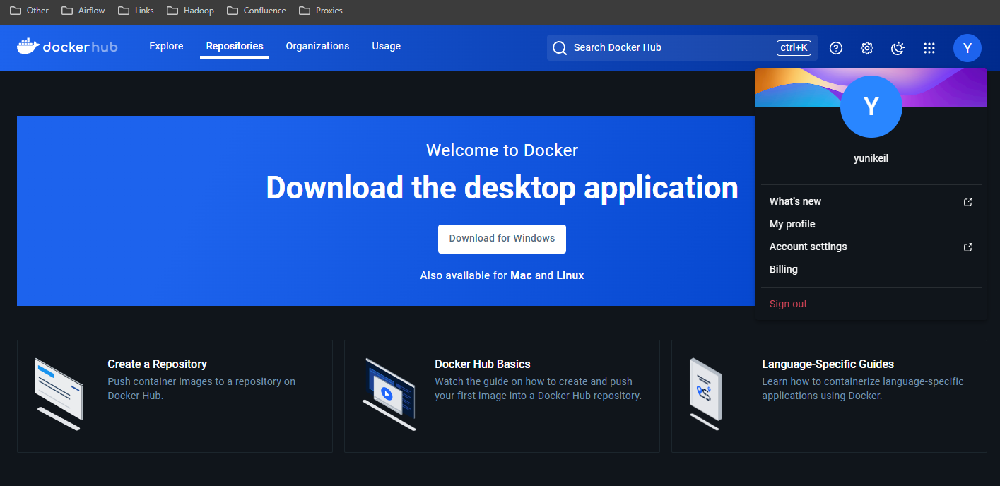

# Практическая работа 1

## Создать учетную запись на ресурсе разработчиков DockerHub. 



## Определить материнскую (host) операционную систему (Windows, Linux, Mac OS) для развёртывания контейнеров Docker.

Операционная система (host) - Windows + WSL2
```shell
yunikeil@lekinu3600:~$ lsb_release -a
No LSB modules are available.
Distributor ID: Ubuntu
Description:    Ubuntu 22.04.4 LTS
Release:        22.04
Codename:       jammy
```

## Ознакомиться с документацией по развертыванию ПО Docker на выбранной операционной системе.

Ознакомился с документацией по развёртыванию ПО Docker.

## Изучить инструкции DockerFile.

Изучил инструкции Dockerfile.

## Проверить статуса демона/службы Docker.

```shell
yunikeil@lekinu3600:~$ docker --version
Docker version 27.2.0, build 3ab4256
```

## Проверить список существующих контейнеров.

```shell
yunikeil@lekinu3600:~$ docker ps -a -q
4b08abf3d07b
20b2efca0961
32880b858ac6
```

## Определить образ операционной системы для контейнера.

Образ системы - alpine:latest

##  Получить образ выбранной операционной системы и версии с репозитория DockerHub.

```shell
yunikeil@lekinu3600:~$ docker pull alpine:latest
latest: Pulling from library/alpine
43c4264eed91: Pull complete
Digest: sha256:beefdbd8a1da6d2915566fde36db9db0b524eb737fc57cd1367effd16dc0d06d
Status: Downloaded newer image for alpine:latest
docker.io/library/alpine:latest
```

## Запустить образ, создать контейнер Docker из одного слоя – операционной системы

```shell
yunikeil@lekinu3600:~$ docker run -it --name alpine-simple alpine:latest /bin/sh
/ # uname
Linux
```

## Создать контейнер из двух слоев. Первый слой – базовый, операционная система. Второй слой скрипт выполнения команды «Hello world», например, /bin/echo 'Hello world'.

Был создан контейнер из двух слоёв: [Dockerfile](Dockerfile).
```shell
yunikeil@lekinu3600:/mnt/f/ISEnt/prac2$ docker build -t hello-world-image .
[+] Building 0.1s (5/5) FINISHED                                                                                                                                                                      docker:default
 => [internal] load build definition from Dockerfile                                                                                                                                                            0.0s
 => => transferring dockerfile: 97B                                                                                                                                                                             0.0s
 => [internal] load metadata for docker.io/library/alpine:latest                                                                                                                                                0.0s
 => [internal] load .dockerignore                                                                                                                                                                               0.0s
 => => transferring context: 2B                                                                                                                                                                                 0.0s
 => [1/1] FROM docker.io/library/alpine:latest                                                                                                                                                                  0.0s
 => exporting to image                                                                                                                                                                                          0.0s
 => => exporting layers                                                                                                                                                                                         0.0s
 => => writing image sha256:b47bebce16810e480a6b91112c8db8447cc92ceb78261fe8fa68d3467a2198b9                                                                                                                    0.0s
 => => naming to docker.io/library/hello-world-image                                                                                                                                                            0.0s
yunikeil@lekinu3600:/mnt/f/ISEnt/prac2$ docker run --name hello-world-container hello-world-image
'Hello world'
```


## Добавить в контейнер прикладное программное обеспечение, например, образ web-сервера nginx.

В контейнер [Dockerfile.nginx](Dockerfile.nginx) был добавлен nginx.
```shell
yunikeil@lekinu3600:/mnt/f/ISEnt/prac2$ docker build -t nginx-alpine -f Dockerfile.nginx .
[+] Building 0.1s (6/6) FINISHED
 => [internal] load build definition from Dockerfile.nginx
 => => transferring dockerfile: 167B
 => [internal] load metadata for docker.io/library/alpine:latest
 => [internal] load .dockerignore
 => => transferring context: 2B
 => [1/2] FROM docker.io/library/alpine:latest
 => [2/2] RUN apk update &&     apk add --no-cache nginx
 => exporting to image
 => => exporting layers
 => => writing image sha256:0a5ab8e145a444778c21ffe8f9fb91cff3099d62981b30e4bdb5943084f422e1
 => => naming to docker.io/library/nginx-alpine
yunikeil@lekinu3600:/mnt/f/ISEnt/prac2$ docker run -d -p 8080:80 --name nginx-container nginx-alpine
3c7e4e96c4d8651af9d2a8a02878e1a472e95004d7c19ee23c2d971b42afbd31
yunikeil@lekinu3600:/mnt/f/ISEnt/prac2$ curl localhost:8080
<html>
<head><title>404 Not Found</title></head>
<body>
<center><h1>404 Not Found</h1></center>
<hr><center>nginx</center>
</body>
</html>
```


## Создать с использованием инструкций DockerFile новый контейнер, содержащий не менее пяти слоев.

```shell
yunikeil@lekinu3600:/mnt/f/ISEnt/prac2$ docker build -t my-alpine-nginx -f Dockerfile.five .
[+] Building 0.1s (10/10) FINISHED
 => [internal] load build definition from Dockerfile.five
 => => transferring dockerfile: 539B
 => [internal] load metadata for docker.io/library/alpine:latest
 => [internal] load .dockerignore
 => => transferring context: 2B
 => [1/5] FROM docker.io/library/alpine:latest
 => [internal] load build context
 => => transferring context: 32B
 => [2/5] RUN apk update &&     apk add --no-cache nginx git perl &&     cd /tmp &&     git clone https://github.com/jasonm23/cowsay.git &&     cd cowsay &&     ./install.sh /usr/local &&
 => [3/5] COPY nginx.conf /etc/nginx/nginx.conf
 => [4/5] RUN mkdir -p /usr/share/nginx/html
 => [5/5] RUN cowsay 'Hello World' > /usr/share/nginx/html/index.html
 => exporting to image
 => => exporting layers
 => => writing image sha256:7270e552c94b66379ae89a6a3286c6d38a1b8612bd3532218582f0afc15837fb
 => => naming to docker.io/library/my-alpine-nginx
yunikeil@lekinu3600:/mnt/f/ISEnt/prac2$ docker run -d -p 8080:80 my-alpine-nginx
50dc759e720c298f7327fa82b507774a1f71e731b24afcc24ee7396a6475f050
yunikeil@lekinu3600:/mnt/f/ISEnt/prac2$ curl localhost:8080
 _____________ 
< Hello World >
 ------------- 
        \   ^__^
         \  (oo)\_______
            (__)\       )\/\
                ||----w |
                ||     ||
```

## Проверить список существующих контейнеров.

```shell
yunikeil@lekinu3600:/mnt/f/ISEnt/prac2$ docker ps -a -q
50dc759e720c
3c7e4e96c4d8
c535ea459f73
4b08abf3d07b
20b2efca0961
32880b858ac6
```

## Подготовить материалы в отчет о выполнении практического курса занятий.


