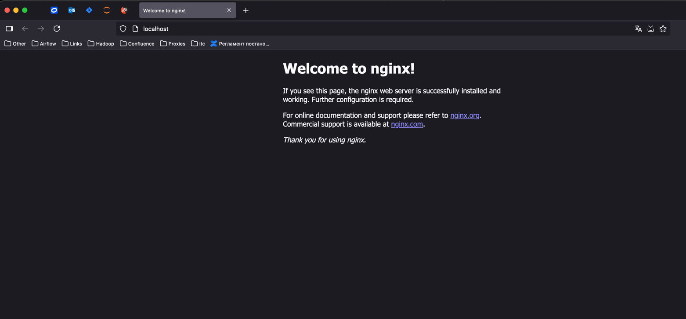
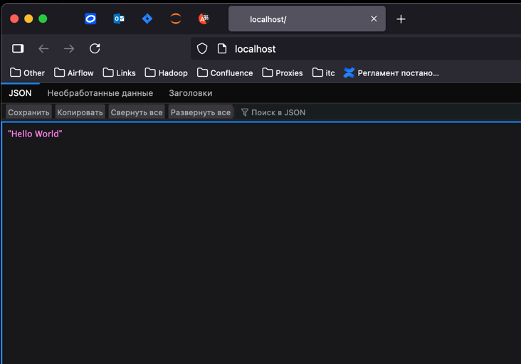
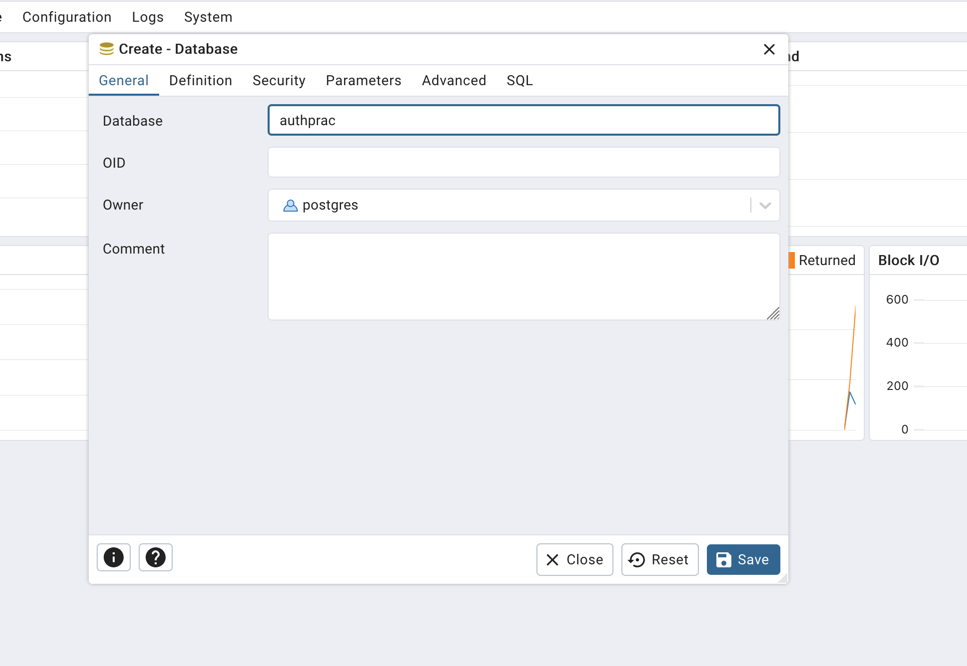
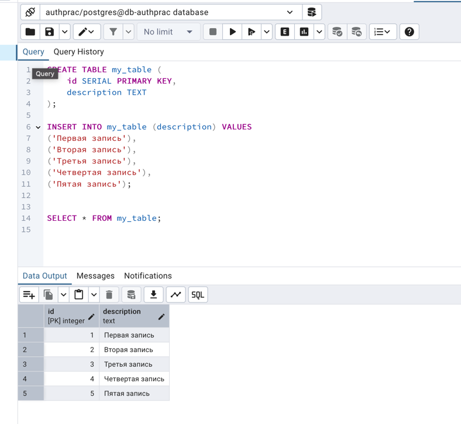
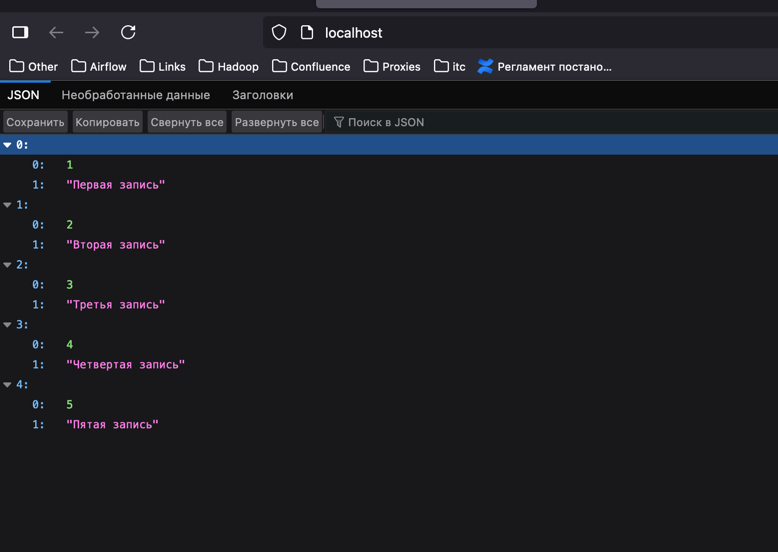

## Получить инсталлятор XAMPP с официального сайта; 

Вместо XAMPP я буду использовать связку Nginx, PostgreSQL, Python + FastAPI + SQLAlchemy + Pydantic, Docker как среду выполнения

## Установить сборку по пути «C:/xampp» компонентами: Apache, MySQL,PHP, phpMyAdmin; 

Был написан Docker Compose для поднятия проекта

## После установки запустить компоненты Apache и MySQL;

После установки был собран и поднят образ docker-compose

## Проверить работу web-сервера Apache: открыть браузер и проверить адрес «http://localhost/». Получить уведомление об успешной установке и запуске; 



## Определить корневую директорию тестового web-сайта. В корневой директории создать простой тестовый сайт и начальный файл web-сайта index.php, содержащий вывод сообщения;

Был создан начальный сайт содержащий текст: `Hello World`

## Проверить работоспособность web-сайта, перейдя в браузере по его адресу;



Парсинг ответа как обычного текста происходит из-за пропущенных заголовков в ответе

## С использованием phpMyAdmin создать новую базу данных, таблицу с двумя столбцами. Первый столбец: тип данных - integer, индекс – primary, auto_increment. Второй столбец типа text;

Создание базы данных:



Создание таблицы и заполнение данными:



## Наполнить таблицу записями;

Наполнение предоставлено выше

## Добавить в код файла index.php скрипт, содержащий инструкции подключения к СУБД, выполнения запроса select …, сохранения результата запроса в массив, вывода записей на web-страницу, отключения от СУБД.

Скрипт  инструкции для подключения:
```python
engine = create_async_engine(
    url=config.DATABASE_URL.unicode_string(),
    pool_size=10,
    max_overflow = 0,
    pool_pre_ping = True,
    connect_args = {
        "timeout": 30,
        "command_timeout": 15,
        "server_settings": {
            "jit": "off",
            "application_name": config.DATABASE_CONNECTION_APP_NAME,
        },
    },
    echo=config.ECHO_SQL
)
async_session = async_sessionmaker(bind=engine, expire_on_commit=False)


async def get_pg_session() -> AsyncGenerator[AsyncSession, None]:
    async with async_session() as db_session:
        yield db_session


@asynccontextmanager
async def context_get_pg_session() -> AsyncGenerator[AsyncSession, None]:
    async with async_session() as db_session:
        yield db_session


def provide_pg_session(
    func: Callable[..., Awaitable]
) -> Callable[..., Awaitable]:
    @functools.wraps(func)
    async def wrapper(*args, **kwargs):
        async with context_get_pg_session() as db_session:
            return await func(*args, session=db_session, **kwargs)
    return wrapper

@provide_pg_session
async def test_pg_connection(session: AsyncSession):
    result = await session.execute(select(1))
    return f"PostgreSQL `SELECT(1)` returned: {result.scalar()}"

```

Выполнение select запроса:

```python
@provide_pg_session
async def get_all(session: AsyncSession):
    r = await session.execute(text("select * from my_table"))
    return [list(row) for row in r.all()]

@app.get("/")
async def redirect_root():
    return await get_all()
```

Результат:




