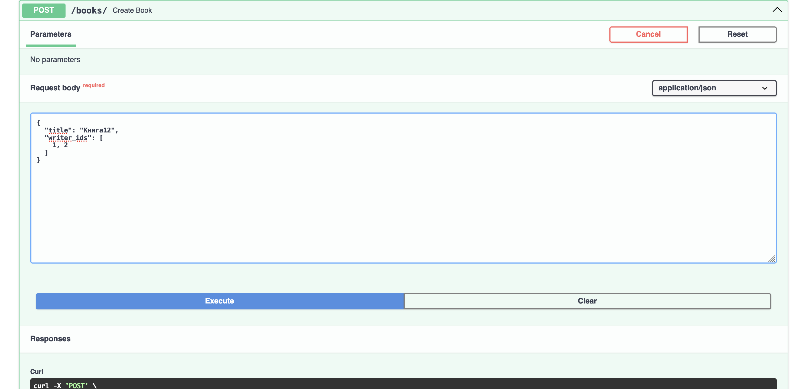
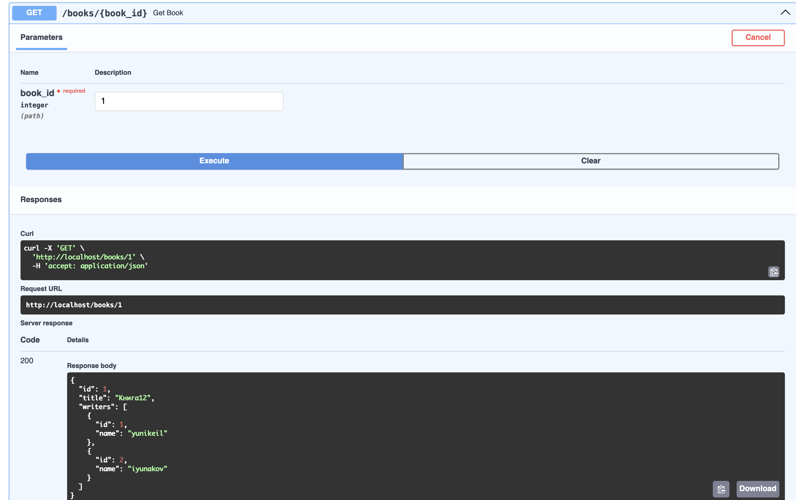
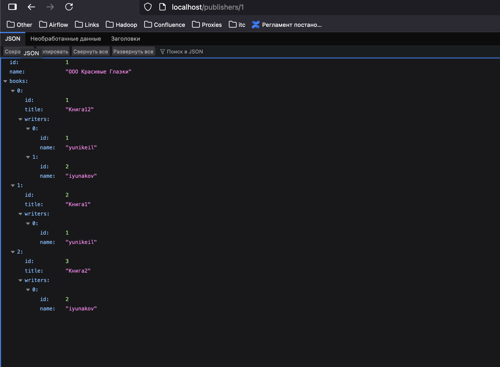
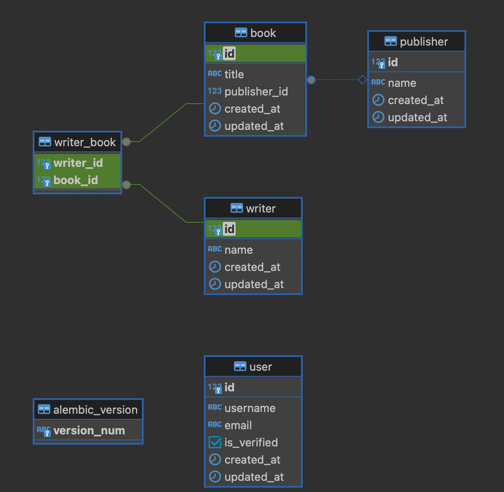

# Практическая работа 5

## На базе инфраструктуры, полученной в результате выполнения практического задания №4, определить скриптовый язык для реализации взаимодействия с базой данных: PHP, Perl, Pyton, NodeJS, ASP.net и др. Определить СУБД: MySQL, SQLite, PostgreSQL, MariaDB, Firebird.

Для взаимодействия с базой данных был выбран Python

## Добавить в интерпретатор скриптового языка соответствующую библиотеку для работы с СУБД, импортировать библиотеку в код.

Для работы были добавлены библиотеки:

* sqlalchemy[asyncio]
* asyncpg
* alembic


## Реализовать в скрипте функции подключения к СУБД, закрытия соединения, Создания базы данных, создания таблиц базы данных, наполнение таблиц баз данных, вывод с объединением данных в таблицах.

Листинг подключения к СУБД (тут же и закрытие соединения):
```python
import functools
from typing import AsyncGenerator, Callable, Awaitable
from contextlib import asynccontextmanager

from core.settings import config

from sqlalchemy.ext.asyncio import create_async_engine, AsyncSession, async_sessionmaker
from sqlalchemy.orm import sessionmaker
from sqlalchemy import select


engine = create_async_engine(
    url=config.DATABASE_URL.unicode_string(),
    pool_size=10,
    max_overflow = 0,
    pool_pre_ping = True,
    connect_args = {
        "timeout": 30,
        "command_timeout": 15,
        "server_settings": {
            "jit": "off",
            "application_name": config.DATABASE_CONNECTION_APP_NAME,
        },
    },
    echo=config.ECHO_SQL
)
async_session = async_sessionmaker(bind=engine, expire_on_commit=False)


async def get_pg_session() -> AsyncGenerator[AsyncSession, None]:
    async with async_session() as db_session:
        yield db_session


@asynccontextmanager
async def context_get_pg_session() -> AsyncGenerator[AsyncSession, None]:
    async with async_session() as db_session:
        yield db_session


def provide_pg_session(
    func: Callable[..., Awaitable]
) -> Callable[..., Awaitable]:
    @functools.wraps(func)
    async def wrapper(*args, **kwargs):
        async with context_get_pg_session() as db_session:
            return await func(*args, session=db_session, **kwargs)
    return wrapper

@provide_pg_session
async def test_pg_connection(session: AsyncSession):
    result = await session.execute(select(1))
    return f"PostgreSQL `SELECT(1)` returned: {result.scalar()}"

```

Создания базы данных, создания таблиц базы данных используется с использованием миграций:
```python
"""Initial tables

Revision ID: 3505010c7436
Revises: 
Create Date: 2024-09-21 13:34:32.846549

"""
from typing import Sequence, Union

from alembic import op
import sqlalchemy as sa


# revision identifiers, used by Alembic.
revision: str = '3505010c7436'
down_revision: Union[str, None] = None
branch_labels: Union[str, Sequence[str], None] = None
depends_on: Union[str, Sequence[str], None] = None


def upgrade() -> None:
    # ### commands auto generated by Alembic - please adjust! ###
    op.create_table('user',
    sa.Column('id', sa.BigInteger(), nullable=False),
    sa.Column('username', sa.String(length=50), nullable=False),
    sa.Column('email', sa.String(length=75), nullable=False),
    sa.Column('is_verified', sa.Boolean(), nullable=False),
    sa.Column('created_at', sa.DateTime(), server_default=sa.text('now()'), nullable=False),
    sa.Column('updated_at', sa.DateTime(), server_default=sa.text('now()'), nullable=False),
    sa.PrimaryKeyConstraint('id')
    )
    op.create_index(op.f('ix_user_email'), 'user', ['email'], unique=True)
    op.create_index(op.f('ix_user_username'), 'user', ['username'], unique=True)
    # ### end Alembic commands ###


def downgrade() -> None:
    # ### commands auto generated by Alembic - please adjust! ###
    op.drop_index(op.f('ix_user_username'), table_name='user')
    op.drop_index(op.f('ix_user_email'), table_name='user')
    op.drop_table('user')
    # ### end Alembic commands ###
```

Листинг наполнения базы и получения данных:
```python
class UserService:
    @staticmethod
    @provide_pg_session
    async def get_user_by_id(user_id: int, session: AsyncSession) -> UserModel:
        query = select(UserModel).filter(UserModel.id == user_id)
        result = await session.execute(query)
        user = result.scalar_one_or_none()
        if not user:
            raise HTTPException(status_code=status.HTTP_404_NOT_FOUND, detail="User not found")
        return user

    @staticmethod
    @provide_pg_session
    async def create_user(user_data: UserCreate, session: AsyncSession) -> UserModel:
        new_user = UserModel(**user_data.model_dump())
        session.add(new_user)
        try:
            await session.commit()
            await session.refresh(new_user)
        except IntegrityError:
            await session.rollback()
            raise HTTPException(
                status_code=status.HTTP_400_BAD_REQUEST,
                detail="User with this username or email already exists"
            )
        return new_user
```

## Создать две таблицы, объединенные связью «многие ко многим». Например, автомобили-водители, отели-туристы, заказчики-исполнители, фильмы-актеры, писатели-книги и т.п. Создать таблицу-справочник для связи «один ко многим».

Были созданы таблицы book, writer, writer_book, publisher
Также был подготовлен код для их изменения

## Наполнить таблицы баз данных осмысленными значениями.

Наполнение данными: 




## Выполнить с помощью скрипта примеры вывода данных, объединенных по трем таблицам.

Пример вывода данных: 





## Составить схему базы данных с использованием MySQL Workbench.

Была создана схема:



