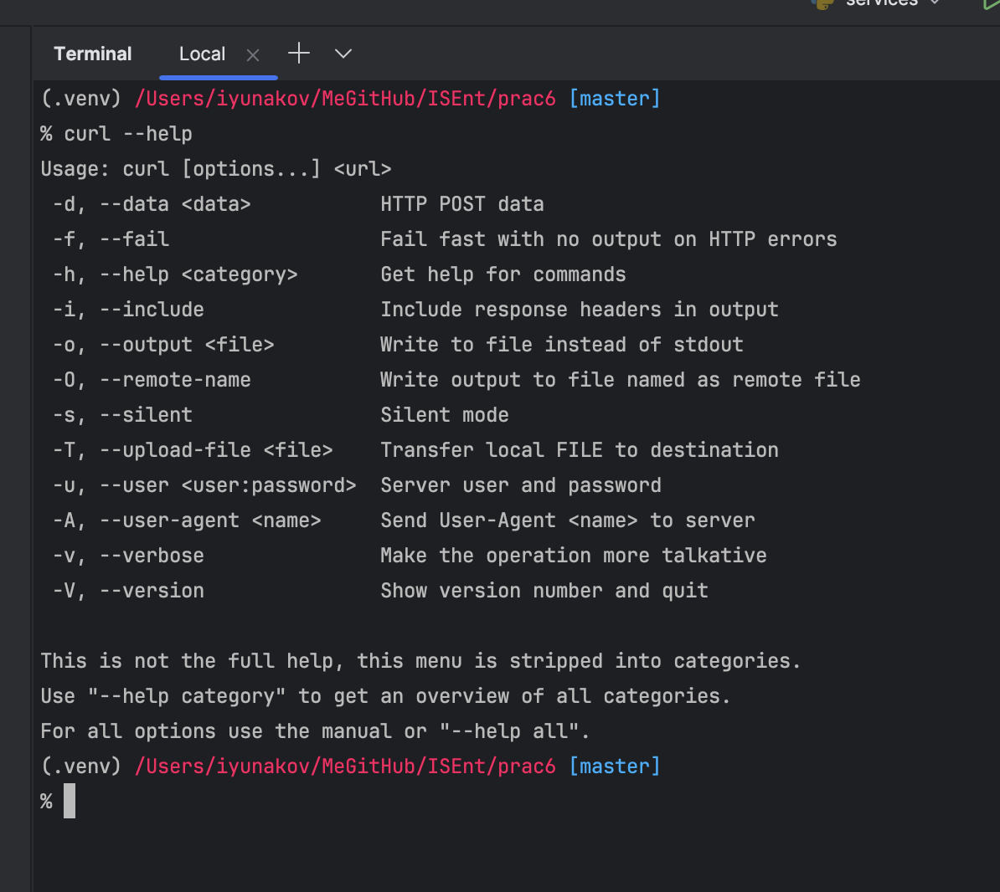
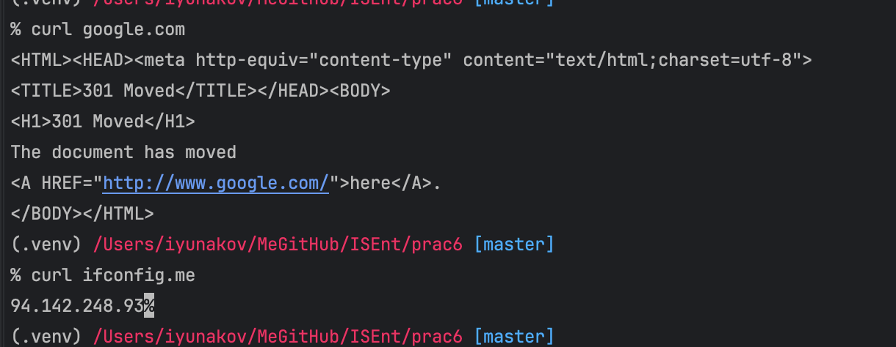
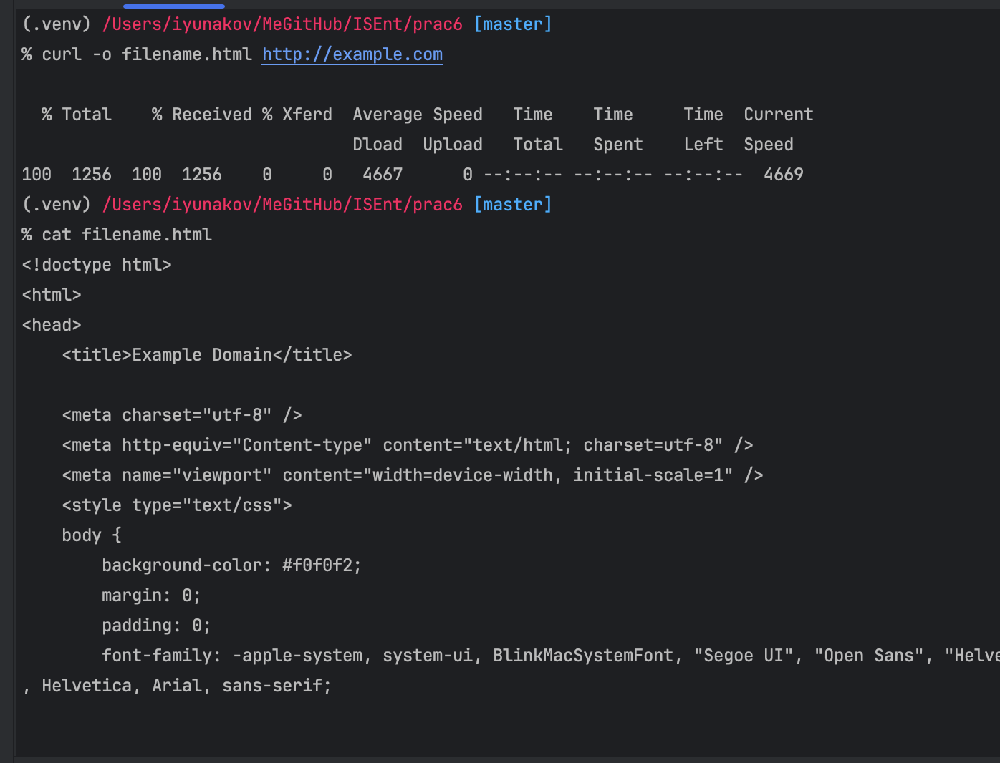
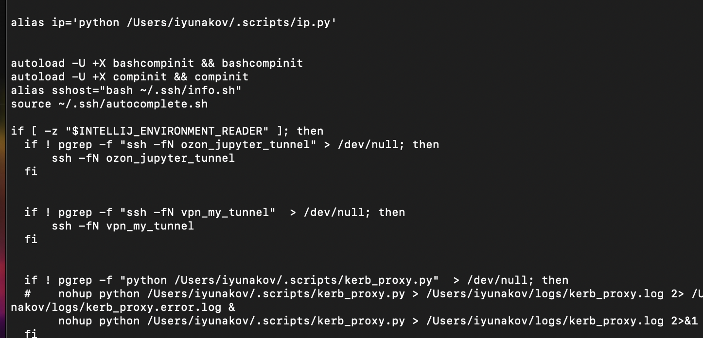
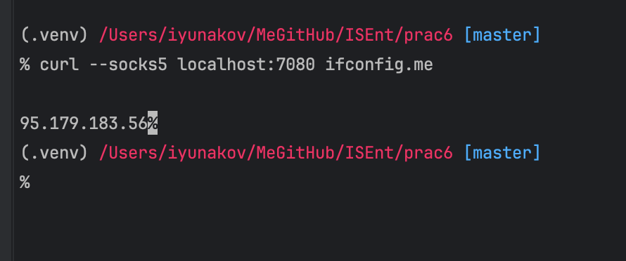
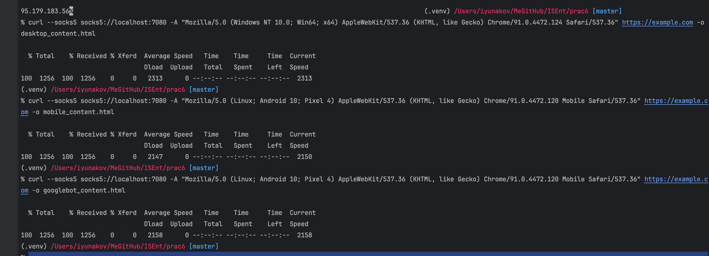
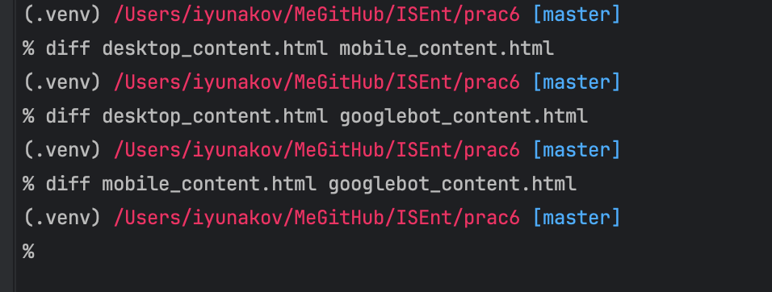
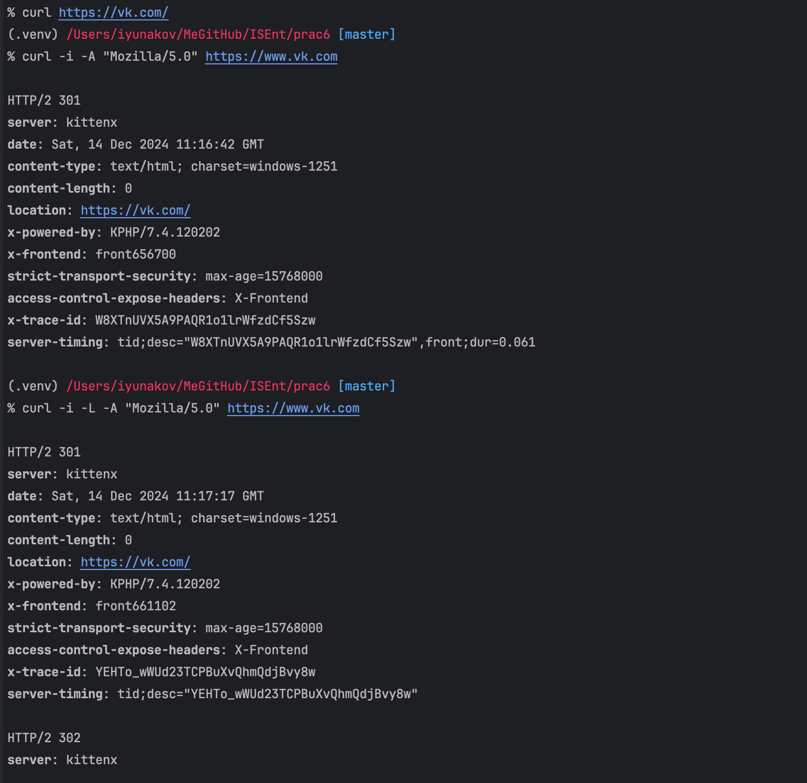
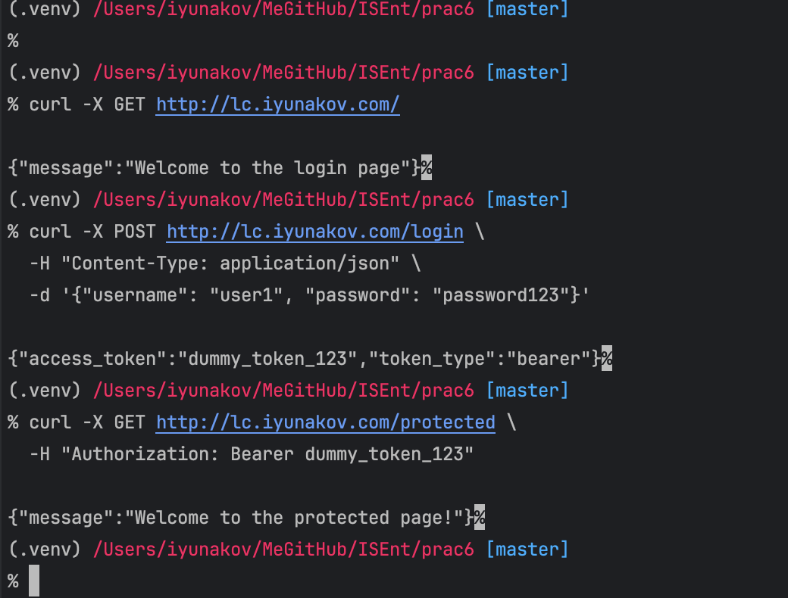

# Практическая работа 6

## Получите исполняемый файл cURL и установите его в операционной системе.  

## Отправить GET-запрос на любой web-сайт.  

## Сохранить содержимое выбранного web-сайта в файл.  

## Выбрать прокси сервер.  

Был выбран ssh socks5 server (Нидерланды)

## Отправить GET-запрос на любой web-сайт через выбранный прокси сервер.  

## Сохранить в файл содержимое web-сайта, полученное через выбранный прокси сервер с эмуляцией вариантов User Agent (десктопный web-браузер, мобильный web-браузер, поисковый робот). Сравнить содержимое файлов с ответами, сделать выводы.  

Сохранение:

Сравнение:

## Отправить GET-запрос на адрес «https://www.vk.com» с помощью браузера, а затем с помощью cURL. Каковы результаты? Просмотреть HTTP-заголовки с помощью cURL и установить причину по которой cURL возвращает пустой ответ. Проверить заголовки запроса повторно, выполнив GET-запрос с перенаправлением.  

inlude location us/ag

## С помощью консоли разработчика браузера установить наименование полей формы ввода информации об авторизации любого web-сайта. Выполнить GET-запрос с авторизацией на любом сайте с помощью cURL. Выполнить POST-запрос с авторизацией на любом сайте с помощью cURL. При необходимости используйте параметры работы с Cookie или определяйте дополнительные заголовки, в том числе токенизированные.  

 
 -c cookies.txt
 -b cookies.txt

